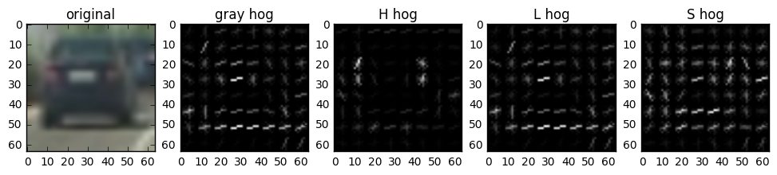
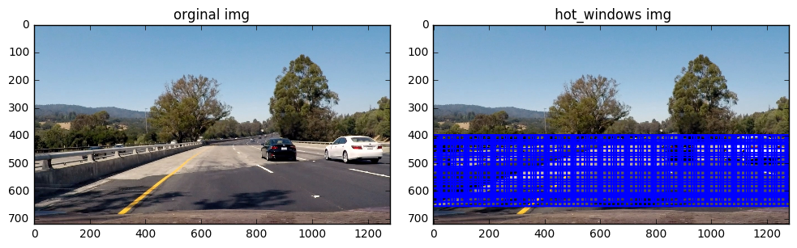

## Advanced Lane Finding

The goals / steps of this project are the following:  

* Compute the camera calibration matrix and distortion coefficients given a set of chessboard images.
* Apply the distortion correction to the raw image.  
* Use color transforms, gradients, etc., to create a thresholded binary image.
* Apply a perspective transform to rectify binary image ("birds-eye view"). 
* Detect lane pixels and fit to find lane boundary.
* Determine curvature of the lane and vehicle position with respect to center.
* Warp the detected lane boundaries back onto the original image.
* Output visual display of the lane boundaries and numerical estimation of lane curvature and vehicle position.

---

### Dependencies

This project requires **Python 3.5** and the following Python libraries installed:

- [Jupyter](http://jupyter.org/)
- [NumPy](http://www.numpy.org/)
- [SciPy](https://www.scipy.org/)
- [scikit-learn](http://scikit-learn.org/)
- [TensorFlow](http://tensorflow.org)
- [Matplotlib](http://matplotlib.org/)
- [Pandas](http://pandas.pydata.org/) 
- [kersar](http://kersar.org/) 

Run this command at the terminal prompt to install [OpenCV](http://opencv.org/). 

## Datasets
In this project I use two datasets. First is project dataset. It is splitted into [cars](https://s3.amazonaws.com/udacity-sdc/Vehicle_Tracking/vehicles.zip) images and [non-car](non-car images) images. 

 

## step 
each to do 

### Histogram of Oriented Gradients (HOG).

After using the picture pixel, histogram and HOG function, I decided to use only a small amount of HOG function. I extracted from the grayscale image because the grayscale image contains all the structural information. I think it is best to only detect the car through structural information, avoid color information, because the car may have a lot of colors. I try to use color gray space, HLS space and YCrCb color space, and finally, I think YCrCb color space effect is the best.

 

### SVM classifier
I use the SVM classifier. After the combined data set, I used 8792 car data and 8968 non-car images for training. The results are about 99.44% accurate. I also use StandardScaler to normalize the feature along the result dataset.

### Sliding windows
For searching cars in an input image I use sliding window technics. It means that I iterate over image area that could contain cars with approximately car sized box and try to classify whether box contain car or not. As cars may be of different sizes due to distance from a camera we need a several amount of box sizes for near and far cars. I use 3 square sliding window sizes of 64, Here is an examples of sliding windows lattices which I use. One of sliding window drawn in blue on each image while rest of the lattice are drawn in black. For computational economy and additional robustness areas of sliding windows don't conver whole image but places where cars appearance is more probable.

 

### car positions and sizes
I use thresholding by average boxes strength to filter out false positives. Here you can see examples of algorithm results. Overlapping by hotboxes shown as heat map where each pixel holds number of overlapped hot boxes.

 

### Video processing
Same average boxes algorithm may be used to estimate cars base on last several frames of the video. 
This pipeline for a single image can be applied to the video the same way.

### Conclusion
It is interesting to detect a car with SVM in a sliding window, but it has several drawbacks. Such as the accuracy of the vehicle is not very high detection accuracy, efficiency is very low, it is in some cases can not be a good promotion and produce a lot of false positives. In order to fight this I use a lot of non-car image SVM training. Also sliding the window to slow down the calculation because it requires many classifiers to try each image. Again, in order to calculate the reduction, the entire area of the input image is not scanned. Thus, when the road has another place in the image, such as a strongly curved turn or the camera moves, the sliding window may not be able to detect the car.
